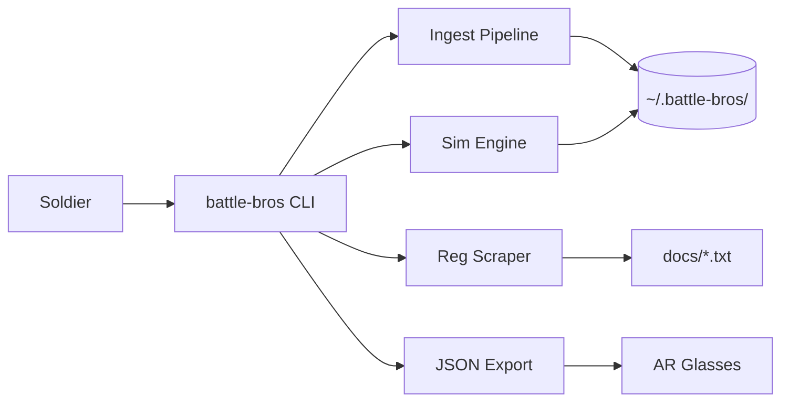

<!-- Unlicense — battle-bros -->

# Proof of Artifacts

*Visual and structural evidence that this project works, ships, and is real.*

> This is not a demo repo. This is a working training tool. The artifacts below prove it.

## Architecture



## Build Output

| Metric | Value |
|--------|-------|
| Binary | `battle-bros` (single binary) |
| Edition | Rust 2024 |
| Regulation entries | 198 |
| Domains | UCMJ, AR 670-1, FM 7-22, AR 600-20 |
| Difficulty tiers | green, amber, red |
| Subcommands | 6 (sim, ingest, train, list, export, scrape) |
| Cloud dependencies | Zero (offline-first) |
| External database | None — JSON on disk |
| Source files | 4 (main.rs, regs.rs, sims.rs, scraper.rs) |
| Direct dependencies | 7 (anyhow, clap, regex, serde, serde_json, dirs, reqwest) |
| License | Unlicense (public domain) |

## How to Verify

```bash
# Clone, build, run. That's it.
cargo build --release
ls -lh target/release/battle-bros
./target/release/battle-bros list          # shows domains + entry counts
./target/release/battle-bros sim --domain ucmj --count 5
./target/release/battle-bros export        # JSON output in export/
```

## Regulation Sources

All US military regulations are public domain — no copyright, no licensing.

| Domain | Source | Entries |
|--------|--------|---------|
| UCMJ | Uniform Code of Military Justice, punitive articles | 23 |
| AR 670-1 | Wear and Appearance of Army Uniforms | ~60 |
| FM 7-22 | Holistic Health and Fitness | ~60 |
| AR 600-20 | Army Command Policy | ~55 |
